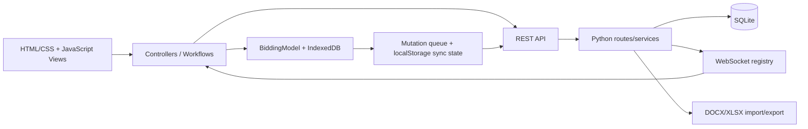
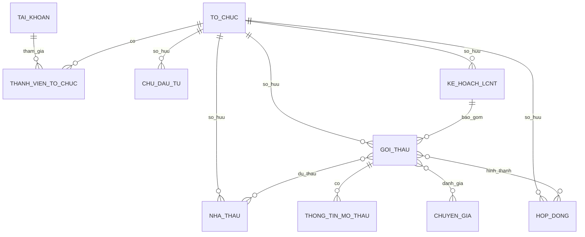

# Báo cáo rà soát toàn bộ hệ thống Bidding

**Ngày rà soát:** 14/07/2026  
**Phạm vi:** frontend, backend, API, xác thực/phân quyền, đồng bộ, WebSocket, mô hình dữ liệu, schema SQLite, công cụ build và kiểm thử.  
**Giả định thiết kế:** hệ thống được triển khai lần đầu trên cơ sở dữ liệu mới; không cần giữ tương thích với dữ liệu cũ. Vẫn phải giữ cơ chế migration và các luồng cập nhật/chỉnh sửa dữ liệu cho những phiên bản về sau.

---

## 1. Kết luận điều hành

Codebase có nhiều nền tảng tốt: backend đã có lọc dữ liệu theo chủ sở hữu ở nhiều luồng, session dùng cookie `HttpOnly`, có CSRF, CSP, PBKDF2, transaction cho đồng bộ, idempotency ID, tombstone, IndexedDB và bộ test tương đối rộng. Các kiểm tra hiện có đều vượt qua.

Tuy nhiên, **hệ thống chưa sẵn sàng để chạy production**. Có tám nhóm lỗi mức P0 cần đóng trước khi phát hành:

1. Backend vẫn khởi động và phục vụ request khi khởi tạo tài khoản quản trị thất bại.
2. IndexedDB, hàng đợi mutation và sync version chỉ tách theo người dùng, không tách theo tổ chức; chuyển workspace có thể gửi dữ liệu của tổ chức A sang tổ chức B.
3. Vai trò quản lý đang là vai trò toàn cục trên tài khoản thay vì vai trò theo membership; có thể tạo leo thang quyền giữa các tổ chức.
4. API “quên mật khẩu” thay mật khẩu ngay khi biết username và email, rồi gửi mật khẩu tạm dạng rõ qua email.
5. Backend tin trực tiếp `X-Forwarded-For`; cơ chế rate limit bền vững trỏ tới bảng không tồn tại và tự rơi về bộ nhớ tiến trình.
6. Template DOCX do người dùng tải lên được render bằng Jinja/docxtpl mà chưa có sandbox/chính sách tag rõ ràng; kiểm tra file nén chưa chống zip bomb đầy đủ.
7. Quy tắc không cho xóa bản ghi đang được tham chiếu chỉ có ở frontend; gọi API trực tiếp vẫn có thể làm mất liên kết lịch sử hoặc xóa dây chuyền.
8. Luồng export gửi lại toàn bộ trạng thái nhưng không có `baseSyncVersion` hay idempotency key, cho phép client cũ ghi đè thay đổi mới.

Ngoài các lỗi P0, các vấn đề P1 quan trọng gồm: ràng buộc identity yếu, CSRF ở luồng Google username, WebSocket chọn sai tổ chức, XSS qua DOM, subscription chỉ mang tính trình diễn, thiếu khóa ngoại tenant kép, tiền dùng `REAL`, validation/coercion im lặng và migration chưa đủ tin cậy.

### Khuyến nghị quyết định phát hành

- Không mở production hoặc nhập dữ liệu thật trước khi hoàn thành toàn bộ P0.
- Vì chưa cần tương thích dữ liệu cũ, nên tạo một **clean baseline migration `0001`** thay vì tiếp tục chắp vá schema hiện tại bằng các hàm backfill lúc startup.
- Chuyển nguồn sự thật của role, subscription, quota, trạng thái tổ chức và validation sang backend/DB; frontend chỉ hiển thị và yêu cầu hành động.
- Sau khi sửa P0/P1, chạy E2E trên DB tạm cô lập, kiểm thử bảo mật có chủ đích và rehearsal backup/restore trước phát hành.

---

## 2. Phạm vi, phương pháp và giới hạn rà soát

### 2.1 Phạm vi đã đọc và đối chiếu

- Toàn bộ mã JavaScript frontend, controller, model, view, workflow, service worker và cấu hình Vite.
- Backend Python: app startup, DB helper/schema/migration, auth, route, sync service, WebSocket, upload/export tài liệu và policy.
- Hợp đồng dữ liệu giữa JavaScript, API mapper và SQLite.
- Quan hệ giữa tài khoản, tổ chức, membership, gói dịch vụ, kế hoạch, gói thầu, nhà thầu, hợp đồng, mở thầu, chuyên gia và phân công.
- Build/lint/test, kích thước bundle, dependency manifest và phạm vi audit phụ thuộc.

### 2.2 Kiểm tra đã thực hiện

| Kiểm tra | Kết quả |
|---|---:|
| JavaScript lint hiện tại | Đạt |
| Module reachability audit | 117 module reachable, đạt |
| Dead-code audit hiện tại | Đạt theo quy tắc bảo thủ của script |
| JavaScript unit test | 130 test đạt |
| API test | 66 test đạt |
| `npm audit` | 0 lỗ hổng trong 205 package npm được quản lý |
| Schema contract sinh lại từ DB trắng | Khớp byte-for-byte, 187.997 byte |
| Secure production build | 1.665.096 byte; gzip khoảng 316,90 KB; khoảng 2,48 giây |
| Production build không obfuscate | 1.043.771 byte; gzip khoảng 232,01 KB; khoảng 0,51 giây |

Kết quả test xanh chỉ cho biết các kỳ vọng hiện được viết trong test vẫn đúng; chúng không loại trừ các lỗi thiết kế và ranh giới tin cậy được nêu trong báo cáo.

### 2.3 Giới hạn

- Không chạy E2E bằng `.env` hiện tại vì test có khả năng chạm DB/credential thật. E2E cần được buộc dùng thư mục tạm, DB tạm và biến môi trường riêng.
- Chưa có manifest/lockfile Python nên không thể tái tạo chính xác môi trường backend và không chạy được `pip-audit` một cách đáng tin cậy.
- Hai thư viện frontend được vendored trực tiếp (`xlsx.full.min.js` 0.18.5 và Lucide) nằm ngoài phạm vi `npm audit`; kết quả “0 vulnerability” không bao phủ các file này.
- Rủi ro template Jinja được xác định từ luồng render và thiếu sandbox. Báo cáo không khẳng định đã chứng minh thực thi mã từ xa; cần có security test riêng, nhưng vẫn phải khóa luồng trước production.

---

## 3. Kiến trúc và luồng dữ liệu hiện tại

### 3.1 Kiến trúc khái quát



Frontend là ứng dụng JavaScript không dùng framework lớn, chia theo model/controller/view nhưng nhiều file đã trở thành “god object”. Dữ liệu được giữ đồng thời ở bộ nhớ, IndexedDB, localStorage và server. Backend Python cung cấp REST, WebSocket và thao tác trực tiếp với SQLite.

### 3.2 Quan hệ nghiệp vụ chính



Vấn đề cốt lõi là schema đã có vai trò trên `thanh_vien_to_chuc`, nhưng auth/policy chủ yếu dùng `tai_khoan.vai_tro` toàn cục. Đồng thời “gói dịch vụ” lại nằm trên tài khoản, trong khi giao diện và nghiệp vụ coi subscription là của tổ chức. Hai điểm này làm sai mô hình quyền và mô hình thương mại ngay từ gốc.

### 3.3 Nguồn sự thật đang bị phân tán

| Khái niệm | Nguồn hiện tại | Vấn đề |
|---|---|---|
| Vai trò | `tai_khoan.vai_tro` và `thanh_vien_to_chuc.vai_tro_trong_to_chuc` | Backend dùng vai trò toàn cục, bỏ qua vai trò membership |
| Tổ chức đang hoạt động | Session server, tên tổ chức trên client, dữ liệu đầu tiên của WS | ID/tên lẫn lộn; WS có thể chọn tổ chức đầu tiên |
| Subscription/quota | Các cột trên tài khoản quản lý + localStorage | Không phải trạng thái của tổ chức và không được backend cưỡng chế |
| Trạng thái đồng bộ | Bộ nhớ + IndexedDB + localStorage + server version | Chỉ scope theo user, không scope theo org |
| Trạng thái giấy tờ tùy chỉnh | `ownerId` từ server nhưng `orgId="1"` ở client | Mất dữ liệu hiển thị sau round trip |
| Tên tổ chức trong profile | Client gửi và tự cập nhật | Backend bỏ qua trường này |

---

## 4. Những điểm đang làm tốt

Các điểm sau nên được giữ lại và phát triển thay vì viết lại toàn bộ:

- Mật khẩu dùng PBKDF2 với salt riêng, số vòng cao và so sánh an toàn.
- Session đặt bằng cookie `HttpOnly`; có `SameSite`, CSRF double-submit và security headers/CSP.
- Cấu hình production có một số kiểm tra an toàn về secret, cookie và origin.
- Nhiều API nghiệp vụ đã lọc `owner_id` ở server thay vì tin dữ liệu frontend.
- Sync service đã có transaction, client mutation ID, sync version, delta/tombstone và rollback test.
- Kiểm tra ownership ở tầng ứng dụng đã bao phủ một số tham chiếu quan trọng.
- SQLite đã bật WAL và busy timeout.
- IndexedDB và mutation queue tạo nền tảng offline tốt nếu được scope đúng theo workspace.
- Có schema contract sinh tự động và kiểm tra drift.
- Có kiểm tra upload/media, công thức tài liệu, rollback đồng bộ và field manifest.
- Tên file upload được làm sạch; ảnh protected có kiểm tra đường dẫn/owner ở nhiều luồng.

---

## 5. Danh mục phát hiện theo mức độ ưu tiên

### Quy ước

- **P0 – Blocker:** có thể gây mất/lộ dữ liệu, chiếm quyền, khóa tài khoản hoặc làm hệ thống khởi động sai; phải sửa trước production.
- **P1 – Cao:** sai tính toàn vẹn/bảo mật/nghiệp vụ quan trọng; nên sửa trước pilot có dữ liệu thật.
- **P2 – Trung bình:** ảnh hưởng hiệu năng, UX, khả năng bảo trì hoặc vận hành; lên kế hoạch ngay sau baseline.
- **P3 – Cải tiến:** tối ưu dài hạn sau khi các invariant chính đã ổn định.

| ID | Mức | Phát hiện | Hậu quả chính |
|---|---|---|---|
| R-01 | P0 | Startup fail-open khi không tạo được admin | Server “sống” nhưng DB chưa sẵn sàng, không có quản trị |
| R-02 | P0 | Dữ liệu offline/sync không tách theo tổ chức | Gửi nhầm hoặc xóa nhầm dữ liệu giữa workspace |
| R-03 | P0 | Role quản lý toàn cục, bỏ qua membership role | Leo thang quyền chéo tổ chức |
| R-04 | P0 | Reset mật khẩu dựa trên username + email | DoS/chiếm quyền và gửi mật khẩu rõ qua email |
| R-05 | P0 | Tin `X-Forwarded-For`; limiter bền vững không hoạt động | Bypass IP allowlist/rate limit |
| R-06 | P0 | Template Jinja chưa sandbox, upload nén chưa chống bomb | Rủi ro SSTI và từ chối dịch vụ |
| R-07 | P0 | Quy tắc xóa chỉ ở frontend | Mất lịch sử, null liên kết hoặc cascade ngoài ý muốn |
| R-08 | P0 | Export ghi full-state không concurrency token | Client cũ ghi đè dữ liệu mới |
| R-09 | P1 | Email/Google ID/password thiếu invariant server/DB | Trùng identity, login bất định, mật khẩu yếu |
| R-10 | P1 | Luồng Google set-username thiếu CSRF token | Request đầu tiên có thể luôn 403 |
| R-11 | P1 | WebSocket chọn tổ chức đầu tiên và revoke chậm | Nhận sự kiện sai org; session cũ tồn tại tới 30 phút |
| R-12 | P1 | Thiếu composite foreign key theo tenant | Quan hệ chéo `owner_id` vẫn hợp lệ ở DB |
| R-13 | P1 | Subscription/quota/lock chỉ mang tính UI | Vượt hạn mức, tổ chức hết hạn vẫn sử dụng được |
| R-14 | P1 | Nhiều DOM sink render dữ liệu server không escape | Stored DOM XSS/UI injection/action injection |
| R-15 | P1 | Contract custom status/profile organization sai | Dữ liệu biến mất hoặc UI báo thành công giả |
| R-16 | P1 | Tiền dùng `REAL`, ngày/boolean/range ít constraint | Sai số tiền và trạng thái không hợp lệ |
| R-17 | P1 | Coercion invalid thành `NULL`/truncation | Dữ liệu xấu được chấp nhận im lặng |
| R-18 | P1 | Một sync version cho toàn bộ tenant | Conflict giả giữa các bản ghi không liên quan |
| R-19 | P1 | Blocking I/O trong async; body limit có thể bypass | Cạn worker/event loop, DoS |
| R-20 | P1 | Trả `str(exception)` cho client | Lộ path, DB detail và nội bộ server |
| R-21 | P1 | Migration so sánh schema không đủ và bỏ qua FK check | Schema drift âm thầm, baseline không đáng tin cậy |
| R-22 | P2 | Trường mở thầu/bảo đảm bị trùng nghĩa | Hai nguồn sự thật và fallback phức tạp |
| R-23 | P2 | Metadata đánh giá lưu blob JSON không schema | Khó query, validate, migration và audit |
| R-24 | P2 | Danh sách tổ chức truyền bằng chuỗi phân tách dấu phẩy | Tên có dấu phẩy làm vỡ contract |
| R-25 | P2 | Bundle đơn lớn, obfuscation làm tăng đáng kể kích thước | Tải/parse chậm, đặc biệt trên máy yếu |
| R-26 | P2 | 63 điểm gọi `fetch` và monkeypatch global | CSRF/error/retry/timeout không đồng nhất |
| R-27 | P2 | Service worker/cache/offline chưa nhất quán | Cache ít giá trị, dữ liệu nhạy cảm lưu dai dẳng |
| R-28 | P2 | UX sync/conflict/form/accessibility còn yếu | Người dùng khó biết dữ liệu đã lưu hay chưa |
| R-29 | P2 | Nhiều file 1.000–5.800 dòng và logic trùng | Khó review, test, tối ưu và ngăn regression |
| R-30 | P2 | Không có manifest/lockfile Python; vendor ngoài audit | First-run không tái tạo được, thiếu SCA/SBOM |
| R-31 | P2 | E2E chưa cô lập, nhiều nhánh bảo mật chưa có test | Test xanh nhưng vẫn bỏ sót invariant quan trọng |
| R-32 | P2 | SQLite đặt trong thư mục OneDrive và chưa có backup flow | WAL/sync file rủi ro, khó scale nhiều worker |

---

## 6. Phân tích chi tiết các lỗi P0

### R-01 – Backend khởi động fail-open

**Bằng chứng**

- `backend/db/db_utils.py:653-658` ném lỗi khi không có `ADMIN_PASSWORD`.
- `backend/app.py:793-797` bắt lỗi, ghi log rồi tiếp tục phục vụ.
- Thử trên DB tạm trắng cho thấy startup ghi lỗi khởi tạo admin nhưng `/api/auth/check-session` vẫn trả anonymous `200`; DB có 31 bảng và 0 tài khoản.
- Hành vi thực tế trái với kỳ vọng trong `.env.example` và README rằng admin được bootstrap khi chạy lần đầu.

**Tác động**

Orchestrator thấy process vẫn healthy dù ứng dụng chưa sẵn sàng. Người vận hành có thể tiếp tục triển khai trên một schema nửa hoàn tất hoặc tưởng rằng lỗi nằm ở frontend.

**Sửa đề xuất**

1. Validation toàn bộ config bắt buộc trước khi bind cổng.
2. Chạy migration và bootstrap admin trong một giai đoạn startup bắt buộc; lỗi phải làm process thoát với exit code khác 0.
3. Tạo `/health/live` chỉ báo process sống và `/health/ready` chỉ `200` khi migration, schema version, admin bootstrap, DB read/write và invariant cơ bản đã đạt.
4. Không log secret; chỉ log tên biến cấu hình thiếu.

### R-02 – Dữ liệu offline có thể đi chéo tổ chức

**Bằng chứng**

- `frontend/app/BiddingModel.js:418-425`: tên IndexedDB chỉ gắn với user.
- `BiddingModel.js:25-37,490-574` và `frontend/app/BiddingControllerSync.js:375-432`: mutation queue, local deletion và last sync version không có organization ID.
- `frontend/admin/AdminUserController.js:802-811`: khi đổi workspace, client gán payload server trực tiếp và gọi `persistData(key)`, từ đó có thể đánh dấu dữ liệu vừa tải là mutation cục bộ.
- Luồng này không gọi đầy đủ `resetWorkspaceData` ở `frontend/app/BiddingController.js:363-387`, không reset hàng đợi/version và không reconnect WebSocket đúng tổ chức.

**Kịch bản lỗi**

1. Người dùng đang ở tổ chức A, mất mạng và sửa dữ liệu; mutation nằm trong queue.
2. Người dùng chuyển sang tổ chức B.
3. Queue cũ vẫn được gửi, backend áp owner hiện tại hoặc client merge với trạng thái B.
4. Dữ liệu A có thể xuất hiện ở B; hoặc tombstone A được áp lên bản ghi B có ID va chạm.

**Sửa đề xuất**

- Scope tất cả client state bằng khóa `{userId}:{organizationId}`: tên DB, object store hoặc partition key, mutation queue, tombstone, sync cursor, cache và draft.
- Viết một state machine duy nhất cho `switchWorkspace`:

  1. khóa thao tác ghi;
  2. kiểm tra pending mutation của org cũ và yêu cầu sync/giữ riêng/hủy có xác nhận;
  3. đóng WebSocket;
  4. đóng DB hoặc đổi partition;
  5. xóa state trong bộ nhớ;
  6. gọi backend đặt active organization bằng ID;
  7. hydrate dữ liệu mới với `trackMutation: false`;
  8. đặt cursor/version của org mới;
  9. reconnect và subscribe WebSocket;
  10. mở lại thao tác ghi.

- Không gọi `persistData` cho payload vừa tải từ server. Tách rõ `applyServerSnapshot()` và `commitLocalMutation()`.
- Thêm E2E chuyển A → B → A khi online, offline, có mutation, có tombstone và có hai tab.

### R-03 – Role toàn cục gây leo thang quyền giữa tổ chức

**Bằng chứng**

- Schema có `thanh_vien_to_chuc.vai_tro_trong_to_chuc` tại `backend/db/schema.py:619`.
- `backend/auth/auth_service.py` và `backend/shared/access_policy.py:64-70,150-183` sử dụng `tai_khoan.vai_tro` toàn cục; manager được bỏ qua nhiều module/record policy.
- `backend/auth/session_utils.py:33-65` chỉ xác minh membership của active org, không nạp role membership.
- `backend/auth/auth_routes.py:589-650` cho manager sửa vai trò toàn cục của user cùng tổ chức.
- `backend/api/org_routes.py:17-147` dùng vai trò toàn cục để thêm/xóa thành viên ở mọi tổ chức mà manager đó là member; thiếu bảo vệ target super-admin/peer manager đầy đủ.

**Tác động**

Một người là manager ở tổ chức A nhưng chỉ là employee ở tổ chức B vẫn được xử lý như manager tại B. Manager còn có thể thay vai trò toàn cục của user chia sẻ một tổ chức, tạo hạ quyền hoặc mở rộng quyền ngoài phạm vi mong muốn.

**Sửa đề xuất**

- `users.platform_role` chỉ dành cho quyền nền tảng, ví dụ `super_admin`; user thông thường không có global business role.
- `organization_memberships.role` là nguồn sự thật cho `owner`, `manager`, `employee`, `viewer` trong từng org.
- Mọi session/request context phải chứa `active_org_id`, role của membership và trạng thái org; luôn được đọc/verify server-side.
- Policy nhận `(user_id, org_id, org_role, action, resource)`; không có bypass “manager toàn cục”.
- Chỉ owner hoặc quyền cụ thể mới được mời/xóa/đổi role; không được tự nâng quyền, xóa owner cuối cùng, sửa peer cao hơn hoặc tác động super-admin.
- Ghi audit log trước/sau cho thay đổi membership và role.
- Dùng transaction và invariant “mỗi tổ chức hoạt động phải có ít nhất một owner”.

### R-04 – Reset mật khẩu không chứng minh quyền sở hữu email

**Bằng chứng**

- `backend/auth/otp_routes.py:204-235` nhận username + email, lập tức đổi password và revoke token.
- `otp_routes.py:237-262` gửi mật khẩu tạm dạng rõ qua email sau khi DB đã commit.
- Phản hồi khác nhau có thể hỗ trợ dò username/email; SMTP lỗi sau commit làm chủ tài khoản không biết mật khẩu mới.

**Sửa đề xuất**

- Endpoint yêu cầu reset luôn trả thông báo chung và cùng mã trạng thái/thời gian gần tương đương.
- Nếu identity tồn tại, sinh token ngẫu nhiên đủ mạnh; chỉ lưu `SHA-256(token)`, `expires_at`, `used_at`, `request_ip`, `user_id`.
- Gửi link HTTPS một lần, không gửi password.
- Chỉ đổi password khi redeem token còn hạn trong transaction; kiểm tra password policy, đánh dấu token đã dùng và revoke toàn bộ session.
- Rate limit theo IP + identity hash + device signal; không tiết lộ user tồn tại.
- Không ghi token/reset link đầy đủ vào log hoặc analytics.

### R-05 – IP tin cậy và rate limit không đúng ranh giới

**Bằng chứng**

- `backend/auth/auth_service.py:23-28` lấy phần tử đầu của `X-Forwarded-For`.
- `backend/auth/auth_helper.py:122-135` dùng IP đó cho allowlist super-admin.
- `auth_service.py:43-79` đọc/ghi rate state vào `sys_config`, nhưng schema không có bảng này; exception bị nuốt và hệ thống rơi về dictionary trong bộ nhớ ở dòng 80-85.

**Tác động**

Nếu ứng dụng có thể được truy cập trực tiếp hoặc proxy không xóa header từ client, attacker tự đặt XFF để giả IP allowlist. Limiter theo bộ nhớ mất sau restart và không đồng bộ giữa worker.

**Sửa đề xuất**

- Mặc định dùng socket peer IP.
- Chỉ đọc forwarded header khi peer nằm trong danh sách CIDR proxy tin cậy; cấu hình rõ số hop và để reverse proxy ghi đè header.
- Không dùng IP allowlist như lớp xác thực duy nhất cho super-admin; bắt buộc MFA/WebAuthn hoặc TOTP và re-auth cho thao tác nhạy cảm.
- Dùng Redis/DB rate limiter có increment nguyên tử, TTL, giới hạn theo IP/user/route và không fail-open âm thầm.
- Startup phải xác nhận backend của limiter hoạt động; nếu fallback được cho phép thì phải cảnh báo/metric rõ ràng.

### R-06 – Template tài liệu và file nén chưa được cô lập

**Bằng chứng**

- `backend/documents/custom_exporter.py:803-816` render template upload bằng `DocxTemplate.render(context)` với môi trường Jinja mặc định.
- Khi render lỗi, `custom_exporter.py:817-868` có nhánh trả lại template gốc, che mất lỗi xử lý.
- Upload DOCX/XLSX chủ yếu kiểm tra kích thước nén, magic/required filenames; chưa thấy giới hạn tổng uncompressed bytes, số entry, tỷ lệ nén, độ sâu XML hay thời gian parse.
- Các route xử lý pandas/openpyxl/docxtpl đồng bộ trong async handler.

**Sửa đề xuất**

- Dùng `jinja2.sandbox.SandboxedEnvironment`, `StrictUndefined`, allowlist filter/test, cấm attribute traversal/call và chỉ cho grammar placeholder/loop thật sự cần thiết.
- Trước render, parse toàn bộ tag và từ chối tag ngoài allowlist. Nếu nghiệp vụ chỉ cần placeholder, tốt nhất thay Jinja tổng quát bằng engine placeholder giới hạn.
- Security test các payload SSTI phổ biến. Cho tới khi chứng minh được isolation, coi đây là P0; báo cáo không khẳng định đã có RCE.
- Kiểm tra ZIP trước parse: số entry, từng entry, tổng giải nén, ratio, path traversal, encrypted entry, XML size/depth/entity; timeout và memory quota.
- Thực hiện render/import trong worker process/job queue quyền thấp, thư mục tạm riêng, không có secret/network nếu không cần.
- Render lỗi phải trả mã lỗi an toàn; không âm thầm trả file người dùng vừa upload như một export thành công.

### R-07 – Referential delete chỉ được bảo vệ ở client

**Bằng chứng**

- `frontend/shared/VersionedEntityService.js:98-99` có guard tham chiếu.
- `backend/sync/service.py:627-680` chủ yếu kiểm tra quyền rồi thực hiện `DELETE`.
- Nhiều FK dùng `SET NULL` hoặc `CASCADE`; gọi API trực tiếp có thể null hóa snapshot lịch sử hoặc xóa cả cây kế hoạch → gói thầu → dữ liệu dự thầu.

**Sửa đề xuất**

- Quy tắc nghiệp vụ phải nằm ở backend và DB; frontend guard chỉ để UX.
- Master/version đã xuất hiện trong chứng từ lịch sử chỉ được `archive`, không hard-delete.
- Dùng `ON DELETE RESTRICT` cho liên kết lịch sử. Cascade chỉ áp dụng cho aggregate con không có ý nghĩa độc lập và phải được review rõ.
- Nếu cho xóa aggregate, cung cấp endpoint riêng hiển thị impact count, yêu cầu quyền cao/re-auth và ghi audit.
- Thêm test gọi API trực tiếp, bypass frontend và test mọi nhánh reference.

### R-08 – Full-state export bỏ qua optimistic concurrency

**Bằng chứng**

- Luồng sync chuẩn gửi `baseSyncVersion` và `clientMutationId` tại `BiddingModel.js:492-503,631-658` và `BiddingControllerSync.js:197-237`.
- `frontend/app/BiddingController.js:898-907` gửi toàn bộ `goithau`/`hopdong` trước export nhưng không gửi hai trường trên.
- `backend/sync/service.py:147-166` chỉ kiểm tra conflict khi client cung cấp base version.

**Tác động**

Một tab cũ có thể export và vô tình ghi trạng thái cũ lên server trước khi tạo file, làm mất thay đổi của tab/người dùng khác.

**Sửa đề xuất**

- Export phải là thao tác đọc trên server snapshot đã commit; không được ẩn một full-state write bên trong.
- Trước export, client chỉ `await flushPendingMutations()` theo protocol chuẩn; nếu conflict thì buộc giải quyết trước.
- Backend yêu cầu concurrency token và idempotency key cho mọi write, không coi chúng là tùy chọn.
- Export nhận `snapshotVersion`/record IDs và trả file đúng version; nếu version không còn hợp lệ thì trả `409` rõ ràng.

---

## 7. Backend, API và bảo mật

### 7.1 Identity và password policy

Các trường `email` và `google_id` trong `tai_khoan` chưa có invariant unique phù hợp ở schema gốc. Runtime chỉ tạo index email không unique. Login theo email có thể chọn một bản ghi bất kỳ nếu DB đã có duplicate. Pre-check bằng `SELECT` trước `INSERT` không giải quyết race condition.

Registration phía server chủ yếu kiểm tra không rỗng; frontend chỉ yêu cầu mật khẩu tối thiểu 6 ký tự. Change-password cũng không có policy đủ mạnh. Việc gọi `.strip()` trên password ở một số luồng làm thay đổi mật khẩu người dùng đã nhập.

**Thiết kế lại:**

- `username_norm` và `email_norm` chuẩn hóa rõ, unique ở DB với collation/case strategy nhất quán.
- `google_subject` unique, nullable; không dùng email Google làm identifier duy nhất nếu chưa dựa trên subject/issuer.
- Password policy ở server: tối thiểu 12 ký tự, cho phép passphrase, chặn password phổ biến/đã lộ nếu có dịch vụ phù hợp; không ép quy tắc ký tự gây yếu UX.
- Không trim password. Chỉ trim/normalize username/email theo quy tắc đã công bố.
- Giới hạn độ dài request trước khi hash để tránh CPU/memory abuse.
- Dùng DB unique constraint và chuyển integrity error thành `409`/field error; pre-check chỉ để UX.
- Cân nhắc Argon2id cho baseline mới; nếu giữ PBKDF2, lưu algorithm/work factor trong hash để nâng cấp dần khi login.

### 7.2 CSRF và API client

`frontend/auth/AuthController.js:1083-1087` gọi trực tiếp API set username sau Google login mà chưa lấy `X-CSRF-Token`. Middleware `backend/app.py:750-758` yêu cầu token cho authenticated POST, trong khi monkeypatch fetch chỉ được cài sau đó bởi `BiddingController`. Kết quả là luồng thiết lập username lần đầu có thể bị `403`.

Nên có một API client duy nhất được khởi tạo trước mọi controller, chịu trách nhiệm:

- `credentials`, CSRF bootstrap/refresh và active organization header/ID;
- timeout + `AbortController`;
- parse error chuẩn;
- retry có giới hạn chỉ cho request idempotent;
- correlation ID và idempotency key;
- xử lý `401`, `403`, `409`, `429` thống nhất;
- không monkeypatch `window.fetch` toàn cục.

Ngoài ra `_get_username_setup_state` trong `backend/auth/auth_routes.py:223-241` dùng import module không đúng package rồi nuốt exception, làm suggestions/state có thể thiếu. Cần sửa import và không nuốt lỗi logic.

### 7.3 WebSocket

- `backend/sync/websocket.py:15-22` import origin validator qua `from app import ...` và nuốt lỗi. Tùy cách chạy module, validation có thể fail-open.
- Khi xác thực, server lấy tổ chức đầu tiên của user thay vì active org (`websocket.py:55-67`).
- Client chỉ gửi action auth, không gửi organization ID (`BiddingControllerSync.js:503-505`).
- Đổi workspace không có state machine reconnect/resubscribe.
- Socket kiểm tra token theo chu kỳ tới 30 phút; change-password không chủ động disconnect socket cũ.
- Registry ở bộ nhớ chỉ broadcast trong cùng process.

**Thiết kế lại:** WebSocket auth message gửi `activeOrgId` và CSRF/session binding; server xác minh membership rồi subscribe channel org. Khi đổi org phải unsubscribe/reconnect. Session revoke phải publish disconnect ngay. Dùng Redis pub/sub hoặc một event broker khi chạy nhiều worker. Production nên từ chối Origin thiếu/sai; origin validator phải import từ module cấu hình độc lập và lỗi phải fail-closed.

### 7.4 Validation request và coercion

Mapper hiện dùng `safe_float`/`safe_int`; input không hợp lệ có thể trở thành `NULL`, còn số thập phân có thể bị truncate khi ép int. Điều này làm mất phân biệt giữa:

- trường không gửi;
- người dùng chủ động đặt `null`;
- chuỗi rỗng;
- giá trị sai định dạng.

Mỗi endpoint cần schema request rõ ràng, tốt nhất dùng Pydantic/dataclass validator hoặc tương đương:

- từ chối unknown fields ở write nhạy cảm;
- giới hạn length/count/nesting;
- enum/range/date order;
- response lỗi dạng field-level;
- `PATCH` dùng presence marker, không dùng truthy/coercion;
- API dùng camelCase hoặc snake_case nhất quán; mapping chỉ nằm tại boundary.

### 7.5 Async và giới hạn tài nguyên

`backend/partners/address_routes.py:13-85` và Google token verification dùng blocking `urllib` trong async handler với timeout dài. DOCX/XLSX dùng thư viện CPU/blocking trực tiếp trong handler. Khi có nhiều request, event loop bị chặn.

Khuyến nghị:

- Dùng HTTP client async có connect/read/total timeout, pool và circuit breaker; hoặc offload bounded thread pool.
- Cache dữ liệu địa chỉ có TTL; auth/rate-limit endpoint proxy địa chỉ để tránh biến server thành relay công khai.
- Chạy import/export nặng trong job queue/process riêng; giới hạn concurrency và có progress/cancel.
- Middleware hiện dựa nhiều vào `Content-Length`; reverse proxy và ASGI layer phải giới hạn byte stream thực tế, kể cả chunked body.
- Đặt giới hạn riêng cho JSON, ảnh, XLSX, DOCX, số dòng và số bản ghi sync.

### 7.6 Error handling và logging

Nhiều route trả `str(e)` trực tiếp, đặc biệt document, Excel, org và address. Điều này có thể lộ path, SQL, tên bảng hoặc thư viện.

Chuẩn hóa response:

```json
{
  "error": {
    "code": "VALIDATION_FAILED",
    "message": "Dữ liệu không hợp lệ",
    "fields": {"email": "EMAIL_INVALID"},
    "requestId": "..."
  }
}
```

Chi tiết exception chỉ ghi server log có cấu trúc. Thêm redaction cho cookie, token, email, file content và context export. `export_error.log`/`sync_error.log` cần rotation, retention, quyền file và không nằm trong thư mục source/deploy artifact.

### 7.7 Subscription và quota phải được backend cưỡng chế

Hiện package/start/end nằm trên `tai_khoan`; UI suy ra subscription của tổ chức bằng cách lấy một tài khoản manager. Trạng thái tổ chức được khởi tạo là active trong view. Khóa gói dùng localStorage, và các action lock/renew được gắn vào UI nhưng không tìm thấy implementation đầy đủ. API add member không kiểm tra quota/hạn.

Nên có bảng `organization_subscription` duy nhất theo organization, kèm package, trạng thái, thời hạn và quota snapshot. Middleware/service backend kiểm tra subscription cho từng capability. Thao tác add member phải kiểm tra quota trong cùng transaction với insert membership. Các nút renew/lock phải gọi endpoint thực, có permission/audit/idempotency; không lưu nguồn sự thật trong localStorage.

---

## 8. Frontend, hiệu năng và trải nghiệm người dùng

### 8.1 Bundle và tải ban đầu

Build hiện đóng phần lớn ứng dụng vào một bundle. `vite.config.js` tắt code splitting và bật obfuscation nặng. Kết quả đo:

- Không obfuscate: khoảng 1,04 MB raw / 232 KB gzip.
- Secure build: khoảng 1,67 MB raw / 316,90 KB gzip.
- Obfuscation tăng khoảng 60% raw và 36,6% gzip, đồng thời tăng build time gần 5 lần.

Obfuscation không phải ranh giới bảo mật; secret và authorization không bao giờ được bảo vệ bằng code client. Đề xuất:

- Bật code splitting và lazy-load theo role/domain: auth, bidding, contract, admin, super-admin, document export.
- Chỉ tải workflow khi tab tương ứng được mở.
- Tách schema contract 188 KB thành mapping runtime tối thiểu; metadata dành cho tooling không đưa hết vào browser.
- Vendor chunk có cache hash; chỉ tải XLSX/DOCX helper khi import/export.
- Đặt performance budget CI, ví dụ initial JS gzip dưới 150–200 KB và theo dõi parse/eval time trên máy tầm thấp.
- Nếu vẫn dùng obfuscation vì yêu cầu thương mại, chỉ áp vào module thật sự cần và đo lại; không coi đó là security control.

### 8.2 API client và trạng thái lỗi

Có khoảng 63 điểm gọi `fetch` trực tiếp, trong khi `frontend/shared/apiClient.js` mới bao phủ một phần. `BiddingController` monkeypatch `window.fetch`, làm hành vi phụ thuộc thứ tự khởi tạo và khó test.

Nên chuyển từng module sang client trung tâm. Với `403` sau khi recovery workspace, code hiện trả lại response lỗi ban đầu thay vì replay có kiểm soát; UX vì thế vẫn báo thất bại dù recovery thành công. Chỉ replay tự động request idempotent hoặc write có idempotency key; các write khác phải hiển thị hướng xử lý rõ.

### 8.3 DOM XSS và render dữ liệu

CSP giúp giảm một phần tác động nhưng không thay cho output encoding. Một số vị trí đưa dữ liệu server/user trực tiếp vào `innerHTML` hoặc attribute:

- avatar và danh sách user/status trong `frontend/admin/SystemUserView.js`;
- assignment code/name trong cùng view;
- workspace name/id trong `frontend/admin/AdminUserController.js`;
- organization/user/email trên super-admin dashboard;
- delegated action `data-args` chứa ID/username.

Backend profile cũng nhận avatar arbitrary/unbounded. Cần:

- Dùng `textContent`, `createElement`, property assignment và event listener thay vì nối HTML.
- Với URL ảnh, dùng `safeImageSrc`/allowlist scheme và server media ID; không nhận raw `javascript:`, `data:` tùy ý hay remote tracking URL nếu không cần.
- Nếu bắt buộc render HTML, dùng sanitizer có cấu hình allowlist và escape đúng context; HTML text, attribute, URL và JS context không dùng chung một helper.
- Validate length/charset cho username, org name, status color, IDs ở server.
- Không nhét JSON thô vào `data-*`; giữ object trong map nội bộ và dùng opaque key.
- Viết DOM test với payload chứa dấu nháy, tag, SVG, URL scheme và tên tổ chức có dấu phẩy.

### 8.4 Service worker và dữ liệu offline

Service worker cache `/` khi install nhưng lại bypass root khi fetch, nên mục này ít hiệu quả. Một số CSS không version được cache-first, có thể giữ bản cũ. Không nên cache personalized shell/API response dùng cookie.

Đề xuất chỉ precache asset có content hash, network-first cho shell public và không cache API chứa dữ liệu người dùng nếu không có threat model rõ. Khi logout/session expiry/shared device, cung cấp tùy chọn xóa dữ liệu local. Dữ liệu IndexedDB phải scope theo org, có retention và version migration. “Mã hóa IndexedDB” bằng key nằm trong cùng JavaScript không chống XSS; ưu tiên ngăn XSS, giảm dữ liệu lưu và xóa đúng lúc.

### 8.5 UX đồng bộ và conflict

Người dùng cần nhìn thấy trạng thái thay vì chỉ nhận toast sau lỗi:

- trạng thái `Đã lưu cục bộ`, `Đang đồng bộ`, `Đã đồng bộ`, `Có xung đột`, `Mất kết nối`;
- số mutation đang chờ theo workspace;
- “thử lại”, “xem khác biệt”, “giữ bản của tôi”, “dùng bản server” theo permission;
- không cho đổi workspace âm thầm khi còn draft/pending mutation;
- optimistic update phải có rollback rõ và không báo thành công trước response server cho thao tác nhạy cảm;
- autosave debounce theo form, hủy request cũ bằng AbortController;
- dirty-state guard trước đóng tab/chuyển tab.

### 8.6 Form và accessibility

- Server trả lỗi theo trường để focus đúng input, không chỉ toast chung.
- Có summary lỗi cho screen reader, `aria-live` cho trạng thái sync, label/description đầy đủ.
- Dialog cần focus trap, Escape, restore focus và thao tác bàn phím.
- Không dùng màu duy nhất để truyền trạng thái; đảm bảo contrast.
- Với bảng lớn: sticky header, virtualization/pagination, giữ bộ lọc trong URL/session, skeleton thay spinner toàn trang.
- Các thao tác phá hủy hiển thị impact và hỗ trợ undo khi có thể.

---

## 9. Logic thực thể và hợp đồng trường dữ liệu

### 9.1 Tổ chức và membership

API hiện trả danh sách tên tổ chức dạng chuỗi phân tách bằng dấu phẩy; frontend `split(',')`. Tên tổ chức hợp lệ có dấu phẩy sẽ phá contract. Active organization còn được nhận dưới cả ID lẫn tên.

Thay bằng object chuẩn:

```json
{
  "activeOrganizationId": "org_123",
  "organizations": [
    {"id": "org_123", "name": "Công ty A, Miền Nam", "role": "manager", "status": "active"}
  ]
}
```

Mọi write gửi organization ID hoặc lấy từ session context; không dùng name để định danh. Cần quyết định rõ vai trò của `to_chuc.quan_ly_id`: nếu owner đã nằm trong membership thì loại bỏ cột này để không có hai nguồn sự thật; nếu giữ, phải có FK/invariant đồng bộ.

### 9.2 Trạng thái giấy tờ tùy chỉnh

Server trả `ownerId`, đã filter theo active org. Frontend ở `AdminUserController.js:355-376`, `SystemUserView.js:346-365` và `HopDongWorkflow.js:294-295` lại hardcode/filter `orgId="1"`. Sau khi save/reload, object không có `orgId` nên biến mất khỏi danh sách/dropdown.

Sửa bằng cách bỏ filter client nếu endpoint đã scope org, hoặc dùng `ownerId === activeOrganizationId`. ID không được hardcode. Thêm contract test create → list → reload → select trong workflow.

### 9.3 Tên tổ chức trong profile

Profile hiển thị organization name là trường editable; client gửi `organization_name` rồi cập nhật state như đã thành công, nhưng backend update-profile bỏ qua trường này. Đây là “thành công giả”.

Hoặc biến trường thành read-only, hoặc tạo endpoint đổi tên tổ chức yêu cầu role phù hợp, re-auth/audit và trả object server mới. Client chỉ cập nhật từ response đã được server xác nhận.

### 9.4 Trường mở thầu và bảo đảm dự thầu trùng nghĩa

`thong_tin_mo_thau` đang có các cặp gần trùng:

- `dam_bao_du_thau` và `gia_tri_dam_bao`;
- `hieu_luc_dam_bao` và `hieu_luc_bao_dam_ngay`;
- `hieu_luc_hsdxt` và `hieu_luc_hsdt`;
- kiểu dữ liệu TEXT và INTEGER đan xen.

Frontend phải fallback qua nhiều tên trong `BidEvaluationWorkflow`/`BidProcessWorkflow`, tạo hai nguồn sự thật. Với baseline mới, chỉ giữ trường canonical:

- `bid_security_amount_vnd` – integer, nullable theo phương thức;
- `bid_security_validity_days` – integer không âm;
- `bid_validity_days` – integer không âm;
- các trường đặc thù HSĐXKT/HSĐXTC nằm trong subtype/table tương ứng nếu quy trình thực sự khác.

Đặt unique theo nghiệp vụ cho bản ghi mở thầu, ví dụ `(org_id, package_id, contractor_id, lot_id)` sau khi xác định chính xác cardinality.

### 9.5 Versioning thực thể

Nhiều bảng dùng `phien_ban` dạng TEXT rồi phải `CAST` để sort/compare. Nên đổi thành INTEGER có `CHECK(version >= 1)`. Tách identity ổn định và version sẽ rõ hơn:

- `contractor` chứa ID ổn định, org, trạng thái archive;
- `contractor_version` chứa tên, mã số thuế, địa chỉ, `version_no`, hiệu lực, người tạo;
- các tham chiếu lịch sử trỏ thẳng version ID;
- “current version” là FK/unique có invariant, không suy ra bằng chuỗi.

Mô hình tương tự áp dụng cho chủ đầu tư và những master data cần giữ snapshot. Kế hoạch/gói thầu/hợp đồng có thể dùng row revision/audit thay vì nhân bản toàn dòng nếu nghiệp vụ không cần truy cập nhiều phiên bản độc lập; cần chọn một chiến lược thống nhất.

### 9.6 Metadata JSON đánh giá

`goi_thau.danh_gia_hsdt_metadata` là TEXT JSON được đọc/ghi ở nhiều nơi nhưng không có schema version. Các phần ổn định cần query/audit nên chuẩn hóa thành bảng: vòng đánh giá, tiêu chí, kết quả nhà thầu, điểm, lý do loại và người chấm. Chỉ giữ JSON cho snapshot mở rộng, kèm `schemaVersion`, JSON validation và giới hạn kích thước.

### 9.7 Assignment đa hình

Assignment dùng target type/target ID đa hình nên DB không thể tạo FK trực tiếp. Có ba lựa chọn theo thứ tự ưu tiên:

1. Tách bảng assignment theo loại target nếu số loại hữu hạn.
2. Tạo bảng `work_item` chung làm supertype, target nghiệp vụ tham chiếu một-một.
3. Nếu vẫn đa hình, dùng CHECK enum + trigger kiểm tra target/org + service invariant và test toàn diện.

Không để target ID không có FK/check vì sẽ sinh assignment mồ côi hoặc chéo tenant.

---

## 10. Đánh giá schema và đề xuất clean baseline

### 10.1 Vấn đề schema hiện tại

#### Tenant isolation

Các bảng owner-scoped thường chỉ có FK đơn đến record liên quan. DB không đảm bảo record con và record cha cùng `owner_id`. Tầng ứng dụng kiểm tra một phần nhưng công cụ import, migration, route mới hoặc bug mapper vẫn có thể tạo quan hệ chéo tenant.

**Giải pháp:** mỗi bảng tenant có `organization_id NOT NULL`; parent có `UNIQUE(organization_id, id)` và child dùng composite FK `(organization_id, parent_id) REFERENCES parent(organization_id, id)`. Bật FK mọi connection, chạy `PRAGMA foreign_key_check` sau migration/test.

#### Tiền tệ

Giá gói thầu, giá dự thầu, giá hợp đồng, bảo đảm và nhiều trường tiền đang dùng SQLite `REAL` rồi đi qua JavaScript `Number`. Cả hai đều có sai số nhị phân; JavaScript còn mất chính xác với integer lớn hơn `2^53-1`.

**Giải pháp:** với VND không có phần lẻ, lưu `INTEGER` số đồng và API truyền decimal string nếu có thể vượt safe integer. Backend dùng `Decimal`/integer; frontend format từ string/BigInt-safe library. Nếu hỗ trợ nhiều tiền tệ/phần lẻ, lưu minor units + currency + scale.

#### Kiểu và constraint

- Boolean INTEGER phải có `CHECK(value IN (0,1))`.
- Role, status, permission, document type phải có enum/check hoặc lookup table.
- Phần trăm `CHECK(0 <= value AND value <= 100)`.
- Số ngày/số lượng/giá trị `CHECK(value >= 0)`.
- Ngày bắt đầu/kết thúc có invariant thứ tự.
- Timestamp dùng UTC, có millisecond hoặc epoch; không dùng localtime text làm nguồn sự thật.
- Trường nghiệp vụ bắt buộc phải `NOT NULL`; không dựa vào form frontend.
- Custom status cần unique theo `(organization_id, normalized_name)`.

### 10.2 Baseline đề xuất

Không nhất thiết phải dùng đúng tên tiếng Anh dưới đây, nhưng nên giữ ranh giới này:

#### Identity và quyền

- `users(id, username_norm, email_norm, password_hash, platform_role, status, created_at, updated_at)`
- `external_identities(id, user_id, issuer, subject, email_at_link_time, created_at)` với unique `(issuer, subject)`
- `auth_sessions(id, user_id, token_hash, csrf_secret/hash, expires_at, revoked_at, last_seen_at, device_metadata)`
- `password_reset_tokens(id, user_id, token_hash, expires_at, used_at, requested_ip)`
- `organizations(id, name, normalized_name, status, created_at, updated_at, row_version)`
- `organization_memberships(organization_id, user_id, role, status, joined_at)`
- `organization_subscriptions(organization_id, package_id, status, starts_at, ends_at, quota_snapshot, row_version)`
- `service_packages(id, code, name, limits..., active)`

#### Dữ liệu nghiệp vụ

- Tất cả bảng có `organization_id`, `created_by`, `updated_by`, UTC timestamps, `row_version` và trạng thái archive nếu cần giữ lịch sử.
- Master versioned: `investors` + `investor_versions`, `contractors` + `contractor_versions`.
- Procurement: `procurement_plans`, `packages`, `lots`, `bid_openings`, `bid_submissions`, `bid_evaluations`, `award_results`, `contracts`.
- Liên danh và chuyên gia dùng join table có composite FK tenant.
- Tài liệu/ảnh dùng media record có owner, hash, MIME đã xác minh, size và storage key; không lưu raw path do client cung cấp.

#### Đồng bộ và audit

- Mỗi record có `row_version` cho optimistic concurrency chính xác.
- `organization_change_log(sequence, organization_id, entity_type, entity_id, operation, row_version, changed_at)` làm delta cursor.
- `mutation_receipts(organization_id, user_id, client_mutation_id, result, created_at)` unique để idempotency.
- `audit_events` append-only cho role, membership, delete/archive, export, login/reset và thay đổi nhạy cảm.
- Có thể dùng transactional outbox để publish WebSocket/event broker sau commit, tránh DB commit thành công nhưng broadcast thất bại.

### 10.3 Optimistic concurrency mới

Một `sync_metadata.current_version` toàn tenant gây conflict giả: user A sửa gói thầu X khiến user B sửa hợp đồng Y bị `409`. Nên tách:

- `row_version` trên từng record: write gửi `expectedVersion`, SQL update có `WHERE id=? AND row_version=?`;
- `change sequence` toàn org chỉ để client kéo delta, không dùng làm khóa ghi toàn cục;
- server có thể auto-merge các trường không giao nhau nếu patch/event model đủ rõ, nhưng không tự ghi đè full object.

### 10.4 Migration sạch nhưng vẫn hỗ trợ nâng cấp sau này

`backend/db/db_utils.py:63-111` hiện so sánh chủ yếu tên/thứ tự/type/NOT NULL; không phát hiện đầy đủ default, CHECK, FK, unique và PK. Rebuild generic tắt FK rồi không chạy `foreign_key_check`; FTS rebuild toàn bộ nhiều bảng mỗi startup. `DB_SCHEMA_VERSION` vẫn rất thô.

Đề xuất:

1. Tạo migration runner có bảng `schema_migrations(version, name, checksum, applied_at)`.
2. `0001_clean_baseline.sql` tạo schema mới hoàn chỉnh; không cần các backfill dữ liệu cũ.
3. Mỗi migration chạy transaction nếu SQLite operation cho phép; kiểm tra pre/post condition.
4. Sau migration chạy `foreign_key_check`, `integrity_check` phù hợp và invariant query.
5. FTS/triggers chỉ tạo/rebuild trong migration hoặc maintenance job, không rebuild toàn bộ lúc mọi startup.
6. Giữ migration forward cho `0002`, `0003`... và test nâng cấp từ từng version được hỗ trợ.
7. Backup trước migration production, có restore rehearsal và checksum.

Vì đây là first-run baseline, có thể loại bỏ các hàm compatibility/backfill dành riêng cho schema cũ như các `_backfill_*`, cleanup alias/trạng thái cũ và field-map trỏ tới cột không còn tồn tại. **Không loại bỏ khả năng update:** giữ migration runner, API `PATCH`, versioning, audit và test nâng cấp cho các phiên bản tương lai.

---

## 11. Tối ưu hiệu năng backend và DB

### 11.1 Chọn nền tảng DB

SQLite phù hợp cho một instance/khối lượng vừa nếu file nằm trên đĩa cục bộ bền vững và chỉ có ít writer. Đặt file SQLite/WAL trong thư mục OneDrive là rủi ro vì cơ chế đồng bộ file có thể xung đột với WAL/lock. Không dùng thư mục sync mạng làm nơi chứa DB sống.

- Nếu triển khai một instance nhỏ: đặt DB trên local persistent volume, một writer process có kiểm soát, backup online đúng cách, WAL checkpoint, retention và integrity monitoring.
- Nếu có nhiều worker/instance hoặc nhiều ghi đồng thời: chuyển PostgreSQL trước production thay vì cố đồng bộ nhiều SQLite file.
- Tách file export/upload/temp/log khỏi DB volume và source tree.

### 11.2 Query và index

- Index bắt đầu bằng `organization_id` cho mọi query tenant; tiếp theo là foreign key/status/sort key theo query thực tế.
- Dùng composite index theo endpoint, ví dụ `(organization_id, updated_at, id)` cho keyset pagination.
- Tránh offset lớn; dùng cursor/keyset.
- Có index cho normalized identity và business key unique.
- Thu thập `EXPLAIN QUERY PLAN` cho màn hình/list/export quan trọng; test ngưỡng dữ liệu thực tế.
- Không tạo index trùng prefix hoặc index cho mọi cột một cách máy móc.
- FTS update bằng trigger/outbox incremental; không rebuild năm bảng mỗi startup.

### 11.3 Payload và đồng bộ

- Không gửi full snapshot cho mutation nhỏ; dùng patch/change set.
- Giới hạn batch theo số operation và byte; response delta phân trang/cursor.
- Nén ở reverse proxy cho JSON đủ lớn, nhưng đặt ngưỡng để tránh CPU lãng phí.
- Export lấy dữ liệu trực tiếp từ server theo snapshot/version, không kéo full dữ liệu qua browser rồi gửi lại.
- Dedupe mutation receipt theo TTL/partition và có cleanup job.

### 11.4 Đo lường

Thêm metric tối thiểu: request latency p50/p95/p99, DB busy time, transaction duration, sync batch size/conflict rate, event-loop lag, job queue depth, WS connection/subscription, cache hit, bundle/web vitals, login/reset/rate-limit events. Không log PII làm label.

---

## 12. Tinh chỉnh và loại bỏ phần dư thừa

### 12.1 Các phần nên loại bỏ hoặc thay thế sau khi có test bảo vệ

- Full-state sync ẩn trong export.
- Monkeypatch `window.fetch`; thay bằng API client được import rõ ràng.
- Chuỗi tổ chức phân tách dấu phẩy và logic nhận org bằng tên.
- `orgId="1"` hardcode trong custom status/workflow.
- “khóa gói” localStorage và nút lock/renew không có backend implementation.
- Optimistic update trường organization name mà server bỏ qua.
- Backfill/alias/compatibility cho schema cũ trong first-run baseline.
- Field-map trỏ đến cột không còn tồn tại.
- Rebuild FTS toàn bộ lúc startup.
- Client-side inactivity timer được coi như security control; backend session expiry/revoke mới là nguồn sự thật.
- Fallback trả raw template khi render thất bại.

### 12.2 Chia nhỏ file lớn

Một số file cần ưu tiên tách:

| File/nhóm | Kích thước xấp xỉ | Hướng tách |
|---|---:|---|
| `frontend/documents/schemaContract.js` | 5.883 dòng / 188 KB | Runtime field map tối thiểu; metadata build-time riêng |
| `BidProcessWorkflow.js` | 1.645 dòng | state machine, validation, render, API adapter |
| `AwardResultDetailsPanel.js` | 1.400 dòng | query model, sections, formatter, event handlers |
| `BidEvaluationWorkflow.js` | 1.385 dòng | domain rules, form schema, calculation, view |
| `AuthController.js` | 1.280 dòng | session, login, registration, Google, reset/profile |
| `GoiThauWorkflow.js` | 1.264 dòng | workflow orchestration và feature modules |
| `BiddingController.js` | 1.221 dòng | bootstrap, workspace, routing, export, network |
| `BiddingModel.js` | 1.165 dòng | entity store, IndexedDB adapter, mutation queue, sync cursor |
| `WordIntegration.js` | 1.075 dòng | upload, template validation, render job/download |

Tách theo trách nhiệm và dependency direction, không chỉ tách theo số dòng. Domain rule phải là hàm thuần có unit test; DOM render và I/O ở mép ngoài. Tránh tạo thêm global singleton/window assignment.

### 12.3 Chuẩn hóa định nghĩa

- Role, permission, status, entity type, field contract chỉ có một nguồn sự thật phía server/schema rồi sinh type/constants cần thiết cho client.
- Không đưa toàn bộ schema nội bộ ra frontend; sinh allowlist DTO.
- Formatter tiền/ngày/nullable và validation dùng chung.
- Tên trường API ổn định, không duy trì cặp alias song song trong baseline mới.

---

## 13. Phụ thuộc, build và khả năng tái tạo first-run

Backend hiện không có `requirements.txt`, `pyproject.toml` hoặc lockfile. README chủ yếu hướng dẫn npm rồi chạy Python, nên máy mới không biết phiên bản dependency chính xác.

Đề xuất:

- Tạo `pyproject.toml` với dependency trực tiếp và Python version; dùng lockfile phù hợp (`uv.lock`, Poetry hoặc pip-tools hash lock).
- Tách dependency runtime/dev; CI cài từ lockfile trên môi trường sạch.
- Thêm `ruff`, formatter, type checker và security/static checks phù hợp; frontend dùng ESLint thực sự thay cho các grep/AST check hẹp hiện tại.
- Audit cả npm, Python và vendored JS; sinh SBOM. Vendor phải có tên, version, source, license, checksum và quy trình update.
- Không kết luận vendored XLSX an toàn chỉ vì `npm audit` xanh.
- `.env.example` phải ghi rõ cấu hình development/production, secure cookie, trusted proxies, allowed origins, DB path và bootstrap secret. Không commit `.env` thật.
- Sửa các ký tự lỗi/corrupt trong README và bổ sung một lệnh first-run có kiểm tra readiness.

Pipeline CI tối thiểu:

1. format/lint/type check;
2. unit frontend/backend;
3. API integration trên DB tạm;
4. schema migration + contract drift + FK/integrity check;
5. E2E cô lập;
6. dependency/SBOM/secret scan;
7. production build + bundle budget;
8. artifact smoke test với config gần production.

---

## 14. Kế hoạch triển khai đề xuất

### Giai đoạn 0 – Chặn rủi ro trước first-run

- Làm startup fail-fast, readiness và migration baseline.
- Sửa reset password, identity unique/password policy.
- Thiết kế role theo membership và policy hierarchy.
- Scope toàn bộ offline/sync state theo user + organization; viết lại workspace switch.
- Bắt buộc concurrency/idempotency cho mọi write; bỏ write trong export.
- Đưa delete/reference policy xuống backend/DB.
- Cấu hình trusted proxy/rate limiter/MFA cho quyền cao.
- Sandbox template, chống zip bomb và cô lập import/export.
- Sửa các DOM sink quan trọng và Google CSRF.

**Gate:** không còn test P0 fail; fresh install thiếu config phải thoát; test chéo org không đọc/ghi/nhận WS được; reset không đổi password trước redeem.

### Giai đoạn 1 – Chuẩn hóa mô hình dữ liệu và API

- Tạo clean schema: user/membership/subscription đúng ranh giới, composite tenant FK, integer money, constraints.
- Chuẩn hóa opening/bid fields, custom status, profile organization và organization DTO.
- Thay global sync lock bằng row version + org change log.
- Typed request/response schema, error envelope và API client trung tâm.
- Audit log và transactional outbox.

**Gate:** `foreign_key_check` sạch; mutation invalid bị từ chối thay vì chuyển `NULL`; duplicate identity/business key không tạo được kể cả concurrent request.

### Giai đoạn 2 – Hiệu năng và UX

- Code splitting/lazy load, giảm schema contract và vendor tải ban đầu.
- Pagination/keyset/index/query plan; không rebuild FTS startup.
- Job queue cho tài liệu; async HTTP/cache địa chỉ.
- UI trạng thái sync/conflict/offline rõ; accessibility và field error.
- Service worker/cache policy mới và local-data retention.

**Gate:** đạt performance budget đã chốt trên thiết bị/network mục tiêu; export/import lớn không chặn request thông thường; workspace switching có UX an toàn.

### Giai đoạn 3 – Vận hành và hardening liên tục

- PostgreSQL nếu cần multi-instance/high concurrency; nếu giữ SQLite thì formalize single-writer deployment.
- Backup/restore rehearsal, monitoring, alert, log redaction/rotation.
- SCA/SBOM/vendor update, secret scan và dependency lock.
- Threat model định kỳ, security test auth/template/upload/tenant isolation.

---

## 15. Ma trận test cần bổ sung

### Auth và quyền

- Fresh DB thiếu admin password/secret/origin: process phải fail.
- Password boundary, khoảng trắng, Unicode, độ dài tối đa, duplicate email case-insensitive.
- Reset: account enumeration, token expired/reused, SMTP lỗi, concurrent redeem, session revoke.
- XFF spoof có/không qua trusted proxy; limiter qua restart/nhiều worker.
- Manager A/employee B; owner cuối cùng; peer manager; target super-admin; đổi active org.
- Google first-login/set-username có CSRF và import đúng.

### Tenant và đồng bộ

- Mọi entity/reference thử ghép parent org A với child org B ở API và DB.
- Offline mutation/tombstone rồi switch A → B; hai tab hai org; reconnect WS.
- Session revoke/change password phải đóng socket ngay.
- Concurrent edit cùng record, khác record, delete-vs-update, retry cùng mutation ID.
- Export từ client cũ không được ghi đè.
- Direct API delete record đang được lịch sử tham chiếu phải bị từ chối.

### Dữ liệu

- Tiền lớn hơn JavaScript safe integer, số âm, decimal không hợp lệ.
- Ngày đảo thứ tự, percent >100, boolean 2, enum lạ, empty/null/absent.
- Version integer và unique current version.
- Tên tổ chức có dấu phẩy/HTML/Unicode; status round trip; profile organization.
- `foreign_key_check`, `integrity_check`, unique business key và migration từ từng schema version hỗ trợ.

### Upload/export

- ZIP nhiều entry, compression ratio cao, XML cực sâu/lớn, path traversal, encrypted entry.
- Template chứa tag/attribute/call ngoài allowlist và các payload SSTI.
- File sai MIME/magic/extension; formula injection trong Excel output.
- Timeout/memory/concurrency, hủy job, cleanup temp và render failure.

### Frontend/UX

- DOM payload ở username/org/status/avatar/assignment/ID/action attributes.
- Keyboard/focus/screen-reader cho dialog, form error và sync status.
- Cache upgrade/logout/shared device/offline reload.
- Bundle budget và Web Vitals trên mobile CPU/network throttling.

E2E phải dùng fixture tạo DB tạm riêng cho từng worker, port tạm và config không thể trỏ tới DB production. Test teardown chỉ được xóa đường dẫn đã xác minh nằm trong workspace tạm.

---

## 16. Tiêu chí nghiệm thu trước production

Hệ thống chỉ nên được coi là sẵn sàng khi tất cả điều kiện sau đạt:

- Toàn bộ P0 đã đóng bằng code + test regression.
- Không có quyền toàn cục vô tình áp sang tổ chức khác; ma trận authorization được test deny-by-default.
- Client state, queue, cursor và WS đều tách theo organization ID.
- Fresh install từ lockfile thành công trên máy/CI sạch; config thiếu làm fail-fast.
- Migration baseline, `foreign_key_check` và invariant test sạch.
- Mọi write có validation, authorization, tenant binding, concurrency và idempotency phù hợp.
- Reset password dùng one-time token; quyền cao có MFA/re-auth; proxy/rate limiter được kiểm thử.
- Template/upload chạy trong giới hạn và sandbox đã được security test.
- Backup đã được tạo **và restore thử thành công**.
- E2E cô lập, dependency audit bao phủ npm/Python/vendor và build đạt performance budget.
- Monitoring có thể phát hiện startup lỗi, DB busy, sync conflict spike, auth abuse, job quá tải và WebSocket disconnect.

---

## 17. Thứ tự công việc khuyến nghị ngay lập tức

Nếu bắt đầu chỉnh sửa code sau báo cáo này, thứ tự ít gây làm lại nhất là:

1. Chốt clean data model cho `user → membership → organization → subscription` và tenant FK.
2. Viết migration `0001` + startup fail-fast/readiness + Python lockfile.
3. Viết lại request context/policy theo active organization và membership role.
4. Viết protocol sync mới: org scope, row version, change log, idempotency; sau đó sửa workspace switch/WebSocket.
5. Sửa auth reset/identity/proxy/rate/MFA.
6. Sửa delete invariants, typed validation và canonical business fields.
7. Khóa template/upload và tách job nặng.
8. Chuyển frontend sang API client trung tâm, loại bỏ DOM sink/contract giả.
9. Tách bundle/module, tối ưu query, hoàn thiện UX sync/accessibility.
10. Chạy full isolated E2E, security regression, backup/restore và production smoke test.

Thứ tự này giữ được toàn bộ khả năng cập nhật/chỉnh sửa dữ liệu về sau, nhưng loại bỏ gánh nặng tương thích ngược không cần thiết ở lần khởi tạo đầu tiên.
