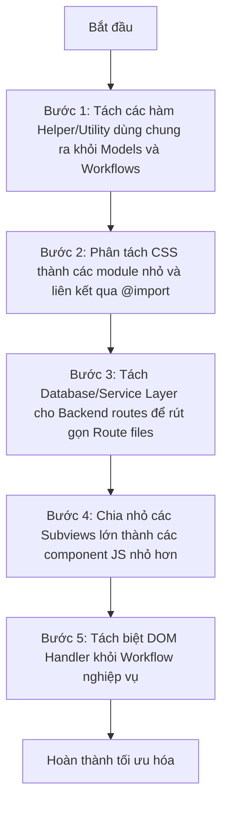

# Báo cáo Phân tích và Tối ưu hóa các File Source Code trên 500 dòng

Tài liệu này phân tích danh sách các file mã nguồn có độ dài vượt quá 500 dòng trong dự án **Bidding**, chỉ ra các vấn đề về mặt kiến trúc, khả năng bảo trì và đề xuất các phương án phân tách, tối ưu hóa cụ thể cho từng file hoặc nhóm file.

---

## 📊 Danh sách các file lớn cần xem xét (> 500 dòng)

Dự án hiện tại có **22 file** vượt quá 500 dòng, được chia thành các nhóm sau:

| STT | Đường dẫn file | Số dòng | Loại file | Vai trò hiện tại |
| --- | --- | --- | --- | --- |
| **Backend (Python)** | | | | |
| 1 | [auth_routes.py](file:///F:/Bidding/backend/routes/auth_routes.py) | 1082 | Python | Định nghĩa API xác thực, session, rate-limiter, OTP, quản lý tổ chức |
| 2 | [routes_docx.py](file:///F:/Bidding/backend/routes/routes_docx.py) | 758 | Python | API export/import tài liệu Word (.docx) |
| 3 | [routes_excel.py](file:///F:/Bidding/backend/routes/routes_excel.py) | 1164 | Python | API import/export và xử lý dữ liệu Excel |
| 4 | [sync_routes.py](file:///F:/Bidding/backend/routes/sync_routes.py) | 1193 | Python | API đồng bộ hóa dữ liệu (WebSockets, replication) |
| 5 | [custom_exporter.py](file:///F:/Bidding/backend/custom_exporter.py) | 820 | Python | Logic xuất bản dữ liệu/tài liệu tùy chỉnh |
| 6 | [schema.py](file:///F:/Bidding/backend/helpers_py/schema.py) | 508 | Python | Định nghĩa cơ sở dữ liệu SQLite schema & di cư dữ liệu |
| **Frontend - Workflows & Controllers (JS)** | | | | |
| 7 | [BidProcessWorkflow.js](file:///F:/Bidding/controllers/workflows/BidProcessWorkflow.js) | 1797 | JS | Luồng nghiệp vụ quy trình thầu (Mở thầu, Phát hành HSMT, v.v.) |
| 8 | [BidEvaluationWorkflow.js](file:///F:/Bidding/controllers/workflows/BidEvaluationWorkflow.js) | 1444 | JS | Luồng nghiệp vụ đánh giá hồ sơ dự thầu |
| 9 | [ExcelIntegration.js](file:///F:/Bidding/controllers/workflows/ExcelIntegration.js) | 1227 | JS | Nghiệp vụ import/export Excel ở phía client |
| 10 | [GoiThauWorkflow.js](file:///F:/Bidding/controllers/workflows/GoiThauWorkflow.js) | 1311 | JS | Nghiệp vụ quản lý vòng đời gói thầu |
| 11 | [KeHoachWorkflow.js](file:///F:/Bidding/controllers/workflows/KeHoachWorkflow.js) | 754 | JS | Luồng nghiệp vụ lập kế hoạch lựa chọn nhà thầu |
| 12 | [HopDongWorkflow.js](file:///F:/Bidding/controllers/workflows/HopDongWorkflow.js) | 544 | JS | Luồng nghiệp vụ quản lý hợp đồng |
| 13 | [BiddingControllerForms.js](file:///F:/Bidding/controllers/main_controller/BiddingControllerForms.js) | 1268 | JS | Xử lý dữ liệu form và các tương tác giao diện chính |
| 14 | [AdminUserController.js](file:///F:/Bidding/controllers/admin/AdminUserController.js) | 890 | JS | Điều khiển quản trị người dùng |
| 15 | [AuthController.js](file:///F:/Bidding/controllers/auth/AuthController.js) | 620 | JS | Điều khiển xác thực client-side (Đăng ký, Đăng nhập, OTP) |
| **Frontend - Views & Modals (HTML/JS/CSS)** | | | | |
| 16 | [GoiThauView.js](file:///F:/Bidding/views/subviews/GoiThauView.js) | 3864 | JS | Giao diện hiển thị, bảng biểu, bộ lọc và sự kiện của Gói thầu |
| 17 | [PartnerView.js](file:///F:/Bidding/views/subviews/PartnerView.js) | 1558 | JS | Giao diện hiển thị và tương tác của đối tác/nhà thầu |
| 18 | [BiddingView.js](file:///F:/Bidding/views/core/BiddingView.js) | 1212 | JS | View trung tâm điều phối giao diện ứng dụng |
| 19 | [SystemUserView.js](file:///F:/Bidding/views/subviews/SystemUserView.js) | 531 | JS | Giao diện quản lý người dùng hệ thống |
| 20 | [modal_goithau.html](file:///F:/Bidding/views/modals/modal_goithau.html) | 517 | HTML | Modal nhập liệu và chỉnh sửa gói thầu |
| 21 | [style.css](file:///F:/Bidding/views/style.css) | 3792 | CSS | Toàn bộ style (CSS) của ứng dụng |
| **Core Models** | | | | |
| 22 | [BiddingModel.js](file:///F:/Bidding/models/BiddingModel.js) | 1165 | JS | Model chứa state và logic xử lý dữ liệu chung client-side |

---

## 🛠️ Đề xuất tối ưu hóa & Phân tách chi tiết cho từng nhóm

### 1. Nhóm Backend Routes (Python - Starlette)

> [!IMPORTANT]
> **Vấn đề cốt lõi:** Các file routes (`auth_routes.py`, `routes_excel.py`, `sync_routes.py`) đang chứa cả **HTTP Routing**, **Business Logic** (quy trình nghiệp vụ), và **Database Queries** trực tiếp. Điều này vi phạm nguyên lý Single Responsibility.

#### Đề xuất giải pháp:
- **Tách Database Layer / Service Layer:** Chuyển tất cả các truy vấn SQL trực tiếp và logic tính toán ra các file helper hoặc file service chuyên biệt (ví dụ: tạo thư mục `backend/services/` chứa `auth_service.py`, `excel_service.py`, `sync_service.py`).
- **Phân tách nhỏ các Module Route:**
  - **`auth_routes.py` (1082 dòng):** Tách thành:
    - `otp_routes.py`: Chỉ xử lý gửi/nhận OTP, rate limit OTP.
    - `org_routes.py`: Xử lý phân quyền tổ chức, thành viên tổ chức.
    - `session_routes.py` (hoặc giữ lại `auth_routes.py` tinh gọn): Chỉ xử lý đăng nhập, đăng xuất, cookie.
  - **`routes_excel.py` (1164 dòng) & `routes_docx.py` (758 dòng):**
    - Trích xuất toàn bộ logic đọc/ghi thư viện `openpyxl`, `python-docx` sang `backend/helpers_py/excel_handler.py` và `backend/helpers_py/docx_handler.py`. Route chỉ nhận file, gọi helper xử lý và trả về JSON/FileResponse.

---

### 2. Nhóm Workflow & Controller (JS)

> [!WARNING]
> **Vấn đề cốt lõi:** Các workflow điều khiển nghiệp vụ (`BidProcessWorkflow.js`, `BidEvaluationWorkflow.js`, v.v.) đang bị ghép chặt (tightly coupled) với DOM client-side (sử dụng nhiều `document.getElementById()`, tự thay đổi class CSS `invalid`, v.v.) kết hợp với logic nghiệp vụ state.

#### Đề xuất giải pháp:
- **Tách biệt DOM Manipulation và Business Logic:**
  - Định nghĩa các hàm helper để xử lý giao diện/DOM (nằm trong các file View tương ứng) và chỉ truyền dữ liệu sạch (clean data) cho Workflow xử lý.
  - Ví dụ: Thay vì `phatHanhHsmtGoiThau(id)` tự lấy giá trị từ DOM bằng `document.getElementById('phathanh-magoithau').value`, hãy để View thu thập dữ liệu form thành một object `{ maGoiThau, soQuyetDinh, ... }` rồi truyền vào hàm xử lý của Workflow.
- **Tạo các Service / Helper dùng chung:**
  - Trích xuất các logic tính toán (ví dụ: parse ngày giờ phức tạp, validate định dạng tiền tệ VND) vào một thư mục `utils/` dùng chung thay vì viết lặp đi lặp lại ở các workflow khác nhau.

---

### 3. Nhóm Giao diện (Views & Stylesheet)

#### 📝 [GoiThauView.js](file:///F:/Bidding/views/subviews/GoiThauView.js) (3864 dòng) & [PartnerView.js](file:///F:/Bidding/views/subviews/PartnerView.js) (1558 dòng)
- **Vấn đề:** Quá lớn do chứa hàng chục hàm tạo HTML động (`render...`), lắng nghe sự kiện của rất nhiều nút bấm khác nhau, và tự định nghĩa bộ lọc dữ liệu.
- **Giải pháp:**
  - **Tách Component nhỏ:** Tách các phần giao diện phụ thành các file module riêng biệt, ví dụ:
    - `GoiThauTable.js`: Chuyên render bảng dữ liệu gói thầu và phân trang.
    - `GoiThauFilters.js`: Chuyên xử lý hiển thị bộ lọc (Năm, Tháng, Trạng thái, Hình thức).
    - `GoiThauDetail.js`: Chuyên render tab chi tiết gói thầu.
  - Đưa các hàm tiện ích render HTML dùng chung vào `views/subviews/view_helpers.js`.

#### 🎨 [style.css](file:///F:/Bidding/views/style.css) (3792 dòng)
- **Vấn đề:** CSS đơn bản cực lớn dẫn đến khó tìm kiếm class và dễ bị ghi đè thuộc tính ngoài ý muốn (CSS specificity issues).
- **Giải pháp:**
  - Phân chia file CSS thành cấu trúc module:
    - `variables.css`: Khai báo CSS Custom Properties (biến màu sắc, font, spacing).
    - `base.css`: Định nghĩa CSS reset, typography, layouts cơ bản (flex, grid).
    - `components/`: Thư mục chứa CSS cho từng thành phần (button.css, modal.css, table.css, select.css).
    - `pages/` hoặc `views/`: CSS đặc thù cho từng view (`goithau.css`, `partner.css`).
  - Sử dụng lệnh `@import` trong một file `style.css` chính để gộp chúng lại, hoặc tận dụng build tool nếu có.

#### 📄 [modal_goithau.html](file:///F:/Bidding/views/modals/modal_goithau.html) (517 dòng)
- **Vấn đề:** Modal chứa quá nhiều trường thông tin thầu phức tạp trong một khối HTML duy nhất.
- **Giải pháp:**
  - Chia nhỏ modal thành các section (Fieldsets hoặc Accordions) sử dụng các template nhỏ, hoặc chia phần HTML thành các tab nhỏ (Thông tin chung, Hồ sơ thầu, Đảm bảo thầu) để dễ quản lý cấu trúc thẻ HTML.

---

### 4. Nhóm Core Models

#### 💾 [BiddingModel.js](file:///F:/Bidding/models/BiddingModel.js) (1165 dòng)
- **Vấn đề:** Quản lý toàn bộ State (Gói thầu, Kế hoạch, Hợp đồng, Nhà thầu, Biên bản, v.v.) và các hàm đồng bộ dữ liệu (Sync), định dạng dữ liệu (VND, Date, String).
- **Giải pháp:**
  - **Tách biệt State Sub-models:** Sử dụng mô hình Composition. Tạo ra các sub-models nhỏ hơn như `GoiThauModel.js`, `ContractModel.js`, `PartnerModel.js` và import chúng vào `BiddingModel.js`.
  - **Tách Helper Class:** Chuyển các hàm định dạng dữ liệu (`formatVND`, `formatForDateInput`, v.v.) sang một thư mục tiện ích `utils/formatters.js`.

---

## 📈 Kế hoạch thực hiện Refactor đề xuất

Nếu tiến hành tối ưu hóa, nên thực hiện theo từng bước nhỏ (Incremental Refactoring) để tránh ảnh hưởng đến tính ổn định của hệ thống:

> [!TIP]
> **Khuyến nghị ưu tiên:** Nên bắt đầu từ **Bước 1 & 2** (CSS và Utils Helper) vì đây là các phần ít rủi ro nhất nhưng mang lại hiệu quả cấu trúc rõ rệt ngay lập tức. Sau đó mới thực hiện tái cấu trúc các file nghiệp vụ phức tạp ở Backend và Workflows.
